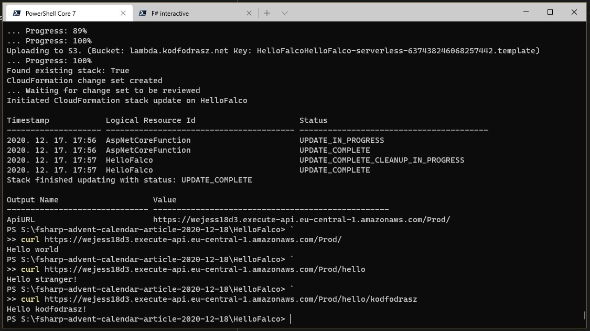

title: Running ASP.Net web application with Falco on AWS Lambda
tags:
 - dotnet
 - dotnet core
 - .Net
 - .Net Core
 - F#
 - fsharp
 - aws
 - lambda
 - falco
 - asp
 - asp.net
---

We have been using AWS Lambda with F# for a while and have some experience with it. Until now, we opted to use the plain AWS Lambda .Net Runtime provided by Amazon because we value simplicity and code being transparent so we can reason about its operation. This is also why we opted for using F#, as it provides a sweet spot in a simple to reason about functional code and rich features provided by the .Net Framework, all with good performance for our use case.

Still, we have met some pain points with developing for and running on AWS Lambda:

One is that the edit-compile-run loop takes a very long time as it involves deployment to Lambda. Testing and interactive debugging are really slow this way. To overcome this, one needs an emulator environment for the Lambda Runtime. Developing one is additional maintenance overhead, so the lookout for a suitable out-of-the-box solution became a background task in my mind.

While reading comments about the announcement of F# 5.0, I found out about the Falco framework, which is a functional-first Asp.Net Core framework. I wondered whether opting for and Asp.Net hosting in Lambda could provide a setup to allow simple local/CI execution while also providing a mostly similar hosting environment in AWS Lambda... so I started to build an experimental setup to evaluate the idea.

The experiment has the main steps:

 1. Getting ASP.Net & Falco running locally with a simple web application
 2. Deploying to AWS Lambda
 3. Using .Net 5.0 in AWS Lambda


# Getting ASP.Net & Falco running locally with a simple web application

## Introducing Falco

[Falco Framework](https://www.falcoframework.com/) is an F# web application framework, based on ASP.Net Core. It is still a work in progress, but its minimalism and non-intrusive API made it really sympathetic for me. I have checked out some other F# web frameworks, but this is the first, which feels cleaner and more straightforward than only using ASP.Net the same object-oriented way I used it from C# in the past.

## Hello World from local Falco

First, let's create a simple sample app to test the hosting setup. Let's stick to the [Falco's Getting Started Guide](https://www.falcoframework.com/#getting-started).

Let's create the official HelloWorld application!

~~~sh
dotnet new -i "Falco.Template::*"
dotnet new falco -o HelloFalco
~~~

This installs the Falco templates, then creates a project in the `HelloFalco` directory based on the `falco` template just installed.

I usually use Visual Studio, so adding a solution for the project is also a good idea (for me).

~~~sh
dotnet new solution -n HelloFalco
dotnet sln add HelloFalco
~~~

Now I can simply open the solution and check the `Program.fs` file. For now, we simply stick to the contents in the template.

Let's start it! If using Visual Studio choose the HelloWordApp from the run configurations to use the Kestrel based hosting instead of IIS Express.


Now you should see something like this:


## Adding a route

Before we move on to the next phase, let's add another – parameterized – route from the Falco examples. This will be used to validate the hosting setup in the next phase. The complete program is still very compact, looks as follows:

~~~fsharp
module HelloFalco.Program

open Falco
open Falco.Routing
open Falco.HostBuilder
open Microsoft.AspNetCore.Builder
open Microsoft.AspNetCore.Hosting
open Microsoft.Extensions.DependencyInjection

// ------------
// Register services
// ------------
let configureServices (services : IServiceCollection) =
    services.AddFalco() |> ignore

// ------------
// Activate middleware
// ------------
let configureApp (endpoints : HttpEndpoint list) (ctx : WebHostBuilderContext) (app : IApplicationBuilder) =
    let devMode = StringUtils.strEquals ctx.HostingEnvironment.EnvironmentName "Development"
    app.UseWhen(devMode, fun app ->
            app.UseDeveloperExceptionPage())
       .UseWhen(not(devMode), fun app ->
            app.UseFalcoExceptionHandler(Response.withStatusCode 500 >> Response.ofPlainText "Server error"))
       .UseFalco(endpoints) |> ignore

// -----------
// Configure Web host
// -----------
let configureWebHost (endpoints : HttpEndpoint list) (webHost : IWebHostBuilder) =
    webHost
        .ConfigureServices(configureServices)
        .Configure(configureApp endpoints)

let helloHandler: HttpHandler =
  let getMessage (route: RouteCollectionReader) =
    route.GetString "name" "stranger"
    |> sprintf "Hello %s!"

  Request.mapRoute getMessage Response.ofPlainText

[<EntryPoint>]
let main args =
  webHost args {
    configure configureWebHost

    endpoints [ get "/" (Response.ofPlainText "Hello world")
                get "/hello/{name?}" helloHandler ]
  }
  0
~~~

Its operation can be quickly verified with cURL.


It runs and responds as expected. 🎉👏

Ok, nothing extraordinary yet. We managed to start a vanilla demo template then extended it with some other demo code. Time for something more interesting.


# Deploying to AWS Lambda

We have managed to reproduce the official Falco tutorial so far. As mentioned earlier, we are actively using AWS Lambda, so now I will show how to deploy a Falco application to Lambda!

For this, I will be using [AWS Serverless Application Model](https://docs.aws.amazon.com/serverless-application-model/), with its .Net tooling. 
I have also used some AWS Lambda function templates as a basis for the configuration files I will present below. All of these can be installed using the dotnet command.

~~~sh
dotnet tool install -g Amazon.Lambda.Tools
dotnet new -i "Amazon.Lambda.Templates::*"
~~~

The template I used is the `serverless.AspNetCoreWebAPI` one. I interested you can check it out with `dotnet new serverless.AspNetCoreWebAPI --language F# --name HelloServerlessAsp`.

## AWS infrastructure prerequisites

Deployment to Lambda using AWS SAM needs a bucket for the storage of the packaged Lambda functions. Assuming your AWS CLI is installed and your credentials are configured, it is a straightforward command to create it. I created the bucket `lambda.kodfodrasz.net` using my default credentials in the region closest to me.

~~~sh
aws s3api create-bucket --bucket lambda.kodfodrasz.net --acl private --create-bucket-configuration LocationConstraint=eu-central-1
~~~

## Configuring a Lambda compatible .Net version

As of writing this article .Net 5.0 has been recently released. However, it is not supported out-of-the-box officially by Amazon, though workarounds exist. 
I have .Net 5.0 installed on my machine, which would result in the app targeting this version, unless configured, which would ultimately result in runtime failures at Lambda invocation time.

To prevent the problems, we must adjust the version settings to target the latest supported runtime version in AWS Lambda: .Net Core 3.1.

First, let's retarget the `HelloFalco.fsproj` project, to contain `<TargetFramework>netcoreapp3.1</TargetFramework>`.

Second, a `global.json` file needs to be added and set up to prevent [automatic version *roll forward*](https://docs.microsoft.com/en-us/dotnet/core/tools/global-json?tabs=netcore3x#rollforward). Add the `global.json` file to the root of the projects (the solution directory).

~~~json
{
  "sdk": {
    "version": "3.1.100",
    "rollForward": "latestMinor"
  }
}
~~~

## Adapt the F# project for use with AWS SAM tools

The Amazon Serverless templates have some special fields set up in their project file. We should add these to ensure Amazon tools handle the project properly.

Also, we will need an additional NuGet package, an adapter between the Lambda runtime and ASP.Net. You could add it using the command `dotnet add package Amazon.Lambda.AspNetCoreServer`, but I simply tuned the `HelloFalco.fsproj` to include these changes mentioned.

However, this is not enough. We need to add the AWS Lambda facette to the Falco project file `HelloFalco.fsproj` as well:

```xml
<Project Sdk="Microsoft.NET.Sdk.Web">

  <PropertyGroup>
    <TargetFramework>netcoreapp3.1</TargetFramework>
    <!-- The next three properties were copied from the AWS Serverless template to ensure tooling compatibility (along with the next comment). -->
    <GenerateRuntimeConfigurationFiles>true</GenerateRuntimeConfigurationFiles>
    <AWSProjectType>Lambda</AWSProjectType>

    <!-- This property makes the build directory similar to a publish directory and helps the AWS .NET Lambda Mock Test Tool find project dependencies. -->
    <CopyLocalLockFileAssemblies>true</CopyLocalLockFileAssemblies>
  </PropertyGroup>

  <ItemGroup>
    <Compile Include="Program.fs" />
  </ItemGroup>
  
  <ItemGroup>
    <PackageReference Include="Falco" Version="3.0.*" />
    <!-- Contains the adapter between AWS Lambda Runtime and ASP.Net Core -->
    <PackageReference Include="Amazon.Lambda.AspNetCoreServer" Version="5.2.0" />
  </ItemGroup>
</Project>
```

## Modify the program for Lambda compatibility

At this point, the program can be compiled and packaged for deployment to AWS. Before finalizing the other deployment configuration files, we need to change the program and support being hosted locally by Kestrel and in the cloud by the Lambda Runtime. 

The modification needed:

 - Move the endpoints to an outer scope, to be reachable from both hosting setup code.  
   Both setups should use this.
 - Add a hosting setup for Lambda, and use the same configuration code as the local setup.

The modified code is still pretty compact and straightforward (but I added some additional comments for easy navigability):

~~~fsharp
module HelloFalco.Program

open Falco
open Falco.Routing
open Falco.HostBuilder
open Microsoft.AspNetCore.Builder
open Microsoft.AspNetCore.Hosting
open Microsoft.Extensions.DependencyInjection

// =============
// The endpoints
// =============
let helloHandler: HttpHandler =
  let getMessage (route: RouteCollectionReader) =
    route.GetString "name" "stranger"
    |> sprintf "Hello %s!"

  Request.mapRoute getMessage Response.ofPlainText

let endpointList =
  [ get "/" (Response.ofPlainText "Hello world")
    get "/hello/{name?}" helloHandler ]

// ===========================
// Common initializaition code
// ===========================

// ------------
// Register services
// ------------
let configureServices (services: IServiceCollection) = services.AddFalco() |> ignore

// ------------
// Activate middleware
// ------------
let configureApp (endpoints: HttpEndpoint list) (ctx: WebHostBuilderContext) (app: IApplicationBuilder) =
  let devMode =
    StringUtils.strEquals ctx.HostingEnvironment.EnvironmentName "Development"

  app.UseWhen(devMode, (fun app -> app.UseDeveloperExceptionPage()))
     .UseWhen(not (devMode),
              (fun app ->
                app.UseFalcoExceptionHandler
                  (Response.withStatusCode 500
                   >> Response.ofPlainText "Server error"))).UseHttpsRedirection().UseFalco(endpoints)
  |> ignore

// =======================
// AWS Lambda Startup code
// =======================

// Lambda entry point
type LambdaEntryPoint() =

  // The base class must be set to match the AWS service invoking the Lambda function. If not Amazon.Lambda.AspNetCoreServer
  // will fail to convert the incoming request correctly into a valid ASP.NET Core request.
  //
  // API Gateway REST API                         -> Amazon.Lambda.AspNetCoreServer.APIGatewayProxyFunction
  // API Gateway HTTP API payload version 1.0     -> Amazon.Lambda.AspNetCoreServer.APIGatewayProxyFunction
  // API Gateway HTTP API payload version 2.0     -> Amazon.Lambda.AspNetCoreServer.APIGatewayHttpApiV2ProxyFunction
  // Application Load Balancer                    -> Amazon.Lambda.AspNetCoreServer.ApplicationLoadBalancerFunction
  //
  // Note: When using the AWS::Serverless::Function resource with an event type of "HttpApi" then payload version 2.0
  // will be the default and you must make Amazon.Lambda.AspNetCoreServer.APIGatewayHttpApiV2ProxyFunction the base class.
  inherit Amazon.Lambda.AspNetCoreServer.APIGatewayProxyFunction()

  override this.Init(builder: IWebHostBuilder) =
    builder
      .ConfigureServices(configureServices)
      .Configure(configureApp endpointList)
    |> ignore


// -----------
// Configure Web host
// -----------
let configureWebHost (endpoints: HttpEndpoint list) (webHost: IWebHostBuilder) =
  webHost
    .ConfigureServices(configureServices)
    .Configure(configureApp endpoints)

// ==========================
// Local Kestrel startup code
// ==========================

// Local execution entry point
[<EntryPoint>]
let main args =
  webHost args {
    configure configureWebHost
    endpoints endpointList
  }
  0
~~~

One thing to note is the common `UseStartup<Startup>()` pattern is not used here. I initially tried that pattern, but it didn't fit seamlessly with the initialization model of Falco. The way I finally settled with is pretty straightforward and convenient, and totally native from both Falco, and vanilla ASP.Net Core. 

We can try this code locally, and it will still work just as before.

## Setting up the deployment configuration

The final step before deployment is to define the deployment configuration for the SAM tools. We need to add two config files to the project directory.

First, add `aws-lambda-tools-defaults.json`. This file defines some defaults for the `dotnet lambda` command family. The deployment bucket created earlier is needed here. I specified my bucket, `lambda.kodfodrasz.net`. Also, an *S3 prefix* is needed, where the data related to this app will be stored. I simply used `HelloFalco`.

Also, we need to define a *stack name*, which is used to group the resources related to the Lambda function, for example, the API gateway settings. I chose the name `HelloFalco`.
If you don't want to use your default profile and region, you can also do so. Otherwise, leave the fields as empty strings.

Overall my config `aws-lambda-tools-defaults.json` looks like this:

~~~json
{
  "Information": [
    "This file provides default values for the deployment wizard inside Visual Studio and the AWS Lambda commands added to the .NET Core CLI.",
    "To learn more about the Lambda commands with the .NET Core CLI execute the following command at the command line in the project root directory.",
    "dotnet lambda help",
    "All the command line options for the Lambda command can be specified in this file."
  ],
  "profile": "",
  "region": "",
  "configuration": "Release",
  "framework": "netcoreapp3.1",
  "s3-prefix": "HelloFalco",
  "template": "serverless.template",
  "template-parameters": "",
  "stack-name": "HelloFalco",
  "s3-bucket": "lambda.kodfodrasz.net"
}
~~~

This file references a *template*, `serverless.template`. That will be the second config file we will need to create.
I copied this file over from the `serverless.AspNetCoreWebAPI` project template, and have tweaked it a bit.

The most important field is the `Handler` item, the entry point where the AWS Lambda Runtime invokes our code. I have the following structure:

`<assembly name>::<handler class fully qualified name>::<handler method>`. In our case:
 - The assembly name is `HelloFalco`
 - The handler class FQN is `HelloFalco.Program+LambdaEntryPoint`. This means that it is an inner class (`LambdaEntryPoint`) of the (static) class `Program` in the `HelloFalco` namespace.  
   If you need to know more about F# and plain CLR interop, I suggest the great reads [F# for Fun and profit about Classes](https://fsharpforfunandprofit.com/posts/classes/#tip-defining-classes-for-use-by-other-net-code) by [Scott Wlaschin](https://twitter.com/ScottWlaschin) and  [Calling F# Code in a C# Project](https://connelhooley.uk/blog/2017/04/30/f-sharp-to-c-sharp) by [Connel Hooley](https://twitter.com/connel_dev).

The other important part is `Events`, which sets up the API Gateway events to be forwarded to the app. This setup basically forwards everything, and all routing is up to Falco/ASP.Net.  
This is the main difference from our current Lambda setup (with regards to routing), as we are using the API Gateway for route part matching, and are simply using the matched parts from the Lambda Event in the raw Lambda setup we currently have.

The `Policies` point is also important, it contains the IAM Policies applied to the web application. In this example I replaced the original template's `AWSLambdaFullAccess` with an almost completely constrained `AWSLambdaBasicExecutionRole`, which should still suffice for this example.

~~~json
{
  "AWSTemplateFormatVersion": "2010-09-09",
  "Transform": "AWS::Serverless-2016-10-31",
  "Description": "An AWS Serverless Application that uses the ASP.NET Core framework running in Amazon Lambda.",
  "Parameters": {},
  "Resources": {
    "AspNetCoreFunction": {
      "Type": "AWS::Serverless::Function",
      "Properties": {
        "Handler": "HelloFalco::HelloFalco.Program+LambdaEntryPoint::FunctionHandlerAsync",
        "Runtime": "dotnetcore3.1",
        "CodeUri": "",
        "MemorySize": 256,
        "Timeout": 10,
        "Role": null,
        "Policies": [
          "AWSLambdaBasicExecutionRole"
        ],
        "Environment": {
          "Variables": {}
        },
        "Events": {
          "ProxyResource": {
            "Type": "Api",
            "Properties": {
              "Path": "/{proxy+}",
              "Method": "ANY"
            }
          },
          "RootResource": {
            "Type": "Api",
            "Properties": {
              "Path": "/",
              "Method": "ANY"
            }
          }
        }
      }
    }
  },
  "Outputs": {
    "ApiURL": {
      "Description": "API endpoint URL for Prod environment",
      "Value": {
        "Fn::Sub": "https://${ServerlessRestApi}.execute-api.${AWS::Region}.amazonaws.com/Prod/"
      }
    }
  }
}
~~~

We can try to deploy out setup now.

~~~sh
cd HelloFalco
dotnet lambda deploy-serverless
~~~

If we cURL onto the path displayed at the end of the successful deployment, we can see that Falco does indeed work in AWS Lambda.



